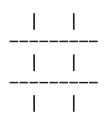
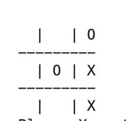
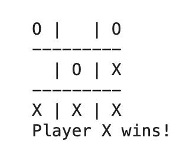
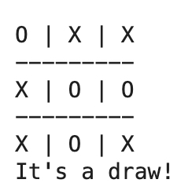

# Tic Tac Toe (Python Jupyter Notebook)

## Overview
This project is a simple two-player Tic Tac Toe game built using Python in a Jupyter Notebook. Players take turns placing X and O on a 3x3 grid until one player wins or the game ends in a draw.

---

## Features
- Two-player turn-based gameplay
- Win detection (rows, columns, diagonals)
- Draw detection
- Input validation
- Interactive notebook execution

---

## ▶️ How to Run
1. Open Jupyter Notebook
2. Open `TicTacToeGame.ipynb`
3. Run all cells from top to bottom

---

## 🎮 How to Play
- Player X goes first
- Enter moves as row and column numbers (1–3)
- Example: `1 1` = top-left corner
- Players alternate turns
- First player to get 3 in a row wins

---

## 🧠 Skills Demonstrated
- Python programming fundamentals
- Control flow and logic design
- Input validation
- Function-based programming
- Game state management

---

## 📸 Screenshots

### Start of Game

### Mid Game

### Winning State

### Draw State

---
